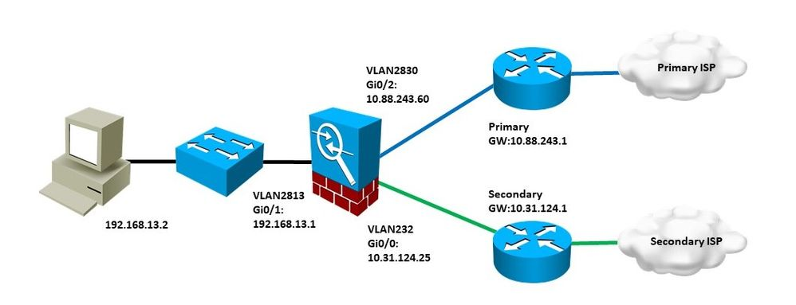

## Cisco FirePower Route Failover

This is a script to perform automated monitoring & failover of a FirePower appliance's primary internet connection. Upon exceeding pre-defined thresholds for packet loss & latency, we can inject a static route to a secondary internet connection. Automatic fail-back to the primary is performed once loss/latency returns to normal.

There are two modules to this script: 

`routefailover.py` - This script performs ping checks of a defined external network target. It will measure response time & packet loss, then make a decision on whether to fail over traffic to a secondary internet provider based on user-defined thresholds

`firepower.py` - This module handles all of the API connectivity to FirePower FDM. This contains all of the logic to create & delete network objects, route objects, etc.

### How to Use

1. Clone repo
2. Install `requirements.txt`
3. Fill out `options.json`
4. Set up cron to run `routefailover.py` at your preferred interval

### `options.json` values

The following options must be configured prior to use:

|  | Ping Test Options |
|--------|-----------------------------------------------------------|
| target | IP Address that we will use to monitor primary connection |
| count  | Number of ICMP messages to send                           |
| max_latency | Maximum latency measured before triggering failover  |
| max_loss | Maximum packet loss measured before triggering failover |

|  | Firepower Config Options |
|--------|-----------------------------------------------------------|
| address | IP Address or host name of the FDM appliance             |
| username | Username that will be used for API access               |
| password | Password that will be used for API access               |
| failover_route | Route & prefix of traffic to push over backup gateway (ex. 0.0.0.0/0)|
| failover_gateway | Next hop IP of backup path (ex. 10.10.10.10)|
| failover_interface | Outbound interface of backup gateway (ex. Ethernet1/1)|

### How can you use it?

1. You need multiple internet connections.

2. Create a static host route (/32) for the ping target via the primary internet connection. This ensures we can continue to monitor the connection even after traffic is moved to the secondary provider.

3. If you are failing over ALL traffic (0.0.0.0/0) - you may want to increase the metric for your primary default route. The backup route gets created with a metric of 1, and we want to make sure that one is preferred.

4. Any other config required on the FirePower box to permit traffic via the second connection (Access lists, NAT rules, etc)